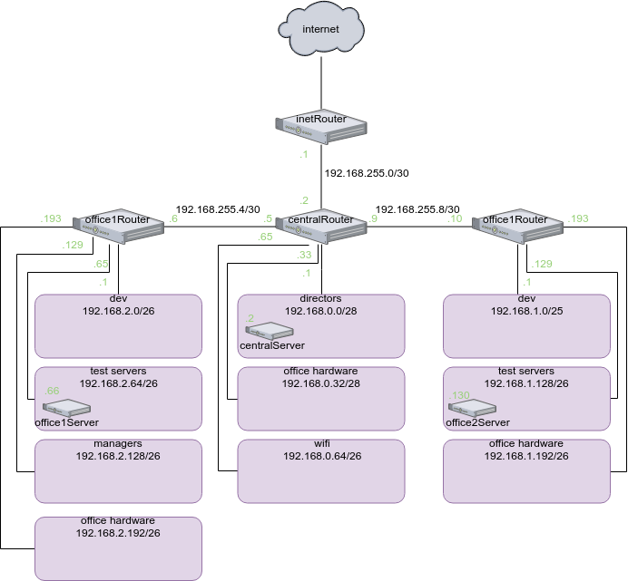

# Вебинар 9. Архитектура сетей

## Домашнее задание

разворачиваем сетевую лабораторию

### Дано

https://github.com/erlong15/otus-linux/tree/network (ветка network)

Vagrantfile с начальным построением сети:

- inetRouter

- centralRouter

- centralServer

тестировалось на virtualbox

### Планируемая архитектура

построить следующую архитектуру

Сеть office1:

- 192.168.2.0/26 - dev

- 192.168.2.64/26 - test servers

- 192.168.2.128/26 - managers

- 192.168.2.192/26 - office hardware

Сеть office2:

- 192.168.1.0/25 - dev

- 192.168.1.128/26 - test servers

- 192.168.1.192/26 - office hardware

Сеть central:

- 192.168.0.0/28 - directors

- 192.168.0.32/28 - office hardware

- 192.168.0.64/26 - wifi

```
Office1 ---\
-----> Central --IRouter --> internet
Office2----/
```

Итого должны получится следующие сервера:

- inetRouter

- centralRouter

- office1Router

- office2Router

- centralServer

- office1Server

- office2Server

### Теоретическая часть

- Найти свободные подсети

- Посчитать сколько узлов в каждой подсети, включая свободные

- Указать broadcast адрес для каждой подсети

- проверить нет ли ошибок при разбиении

### Практическая часть

- Соединить офисы в сеть согласно схеме и настроить роутинг

- Все сервера и роутеры должны ходить в инет черз inetRouter

- Все сервера должны видеть друг друга

- у всех новых серверов отключить дефолт на нат (eth0), который вагрант поднимает для связи

- при нехватке сетевых интервейсов добавить по несколько адресов на интерфейс

## Выполнение



### Теоретическая часть

* 192.168.0.0/28 - broadcast: 192.168.0.15, узлов: 14

* 192.168.0.16/28 - broadcast: 192.168.0.31, узлов: 14, **свободна**

* 192.168.0.32/28 - broadcast: 192.168.0.47, узлов: 14

* 192.168.0.48/28 - broadcast: 192.168.0.63, узлов: 14, **свободна**

* 192.168.0.64/26 - broadcast: 192.168.0.127, узлов: 62

* 192.168.0.192/26 - broadcast: 192.168.0.255, узлов: 62, **свободна**

* 192.168.1.0/25 - broadcast: 192.168.1.127, узлов: 126

* 192.168.1.128/26 - broadcast: 192.168.1.191, узлов: 62

* 192.168.1.192/26 - broadcast: 192.168.1.255, узлов: 62

* 192.168.2.0/26 - broadcast: 192.168.2.63, узлов: 62

* 192.168.2.64/26 - broadcast: 192.168.2.127, узлов: 62

* 192.168.2.128/26 - broadcast: 192.168.2.191, узлов: 62

* 192.168.2.192/26 - broadcast: 192.168.2.255, узлов: 62

* 192.168.255.0/30 - broadcast: 192.168.0.3, узлов: 2

* 192.168.255.4/30 - broadcast: 192.168.0.7, узлов: 2

* 192.168.255.8/30 - broadcast: 192.168.0.11, узлов: 2

* 192.168.255.12/30 - broadcast: 192.168.255.15, узлов: 2, **свободна**

* 192.168.255.16/28 - broadcast: 192.168.255.31, узлов: 14, **свободна**

* 192.168.255.32/27 - broadcast: 192.168.255.63, узлов: 30, **свободна**

* 192.168.255.64/26 - broadcast: 192.168.255.127, узлов: 62, **свободна**

* 192.168.255.128/25 - broadcast: 192.168.255.255, узлов: 126, **свободна**