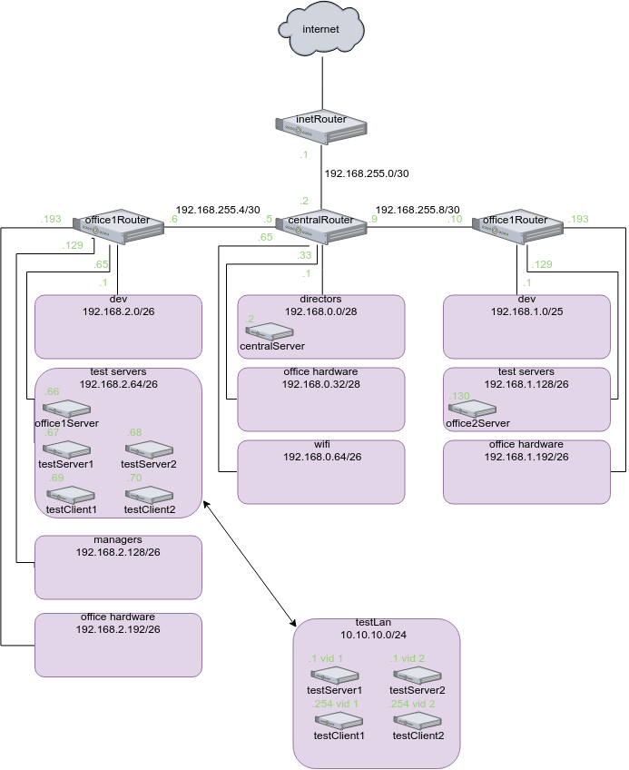

# Вебинар 10. Сетевые пакеты. VLAN'ы. LACP

## Домашнее задание

строим бонды и вланы

в Office1 в тестовой подсети появляется сервера с доп интерфесами и адресами во internal сети testLAN

- testClient1 - 10.10.10.254

- testClient2 - 10.10.10.254

- testServer1- 10.10.10.1 

- testServer2- 10.10.10.1

равести вланами:

testClient1 <-> testServer1

testClient2 <-> testServer2

между centralRouter и inetRouter:

"пробросить" 2 линка (общая inernal сеть) и объединить их в бонд актив-актив

проверить работу если выборать интерфейсы в бонде по очереди

для сдачи - вагрант файл с требуемой конфигурацией

идеально если с клиента можно попасть ssh на сервер без пароля

## Выполнение

