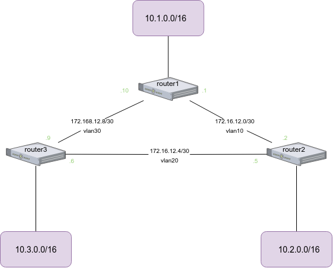

# Вебинар 12. Статическая и динамическая маршрутизация

## Домашнее задание

OSPF

- Поднять три виртуалки

- Объединить их разными vlan

1. Поднять OSPF между машинами на базе Quagga

2. Изобразить ассиметричный роутинг

3. Сделать один из линков "дорогим", но что бы при этом роутинг был симметричным

Присылаем

- вывод ip a

- конфиги /etc/quagga/*

- вывод tracepath для каждого из трёх случаев

## Выполнение



1. Поднять OSPF между машинами на базе Quagga

- вывод ip a

<details>
<summary>router1:</summary>
<p>

```
[vagrant@router1 ~]$ ip a
1: lo: <LOOPBACK,UP,LOWER_UP> mtu 65536 qdisc noqueue state UNKNOWN group default qlen 1000
    link/loopback 00:00:00:00:00:00 brd 00:00:00:00:00:00
    inet 127.0.0.1/8 scope host lo
       valid_lft forever preferred_lft forever
    inet 10.1.0.1/16 brd 10.1.255.255 scope global area1
       valid_lft forever preferred_lft forever
    inet6 ::1/128 scope host 
       valid_lft forever preferred_lft forever
2: eth0: <BROADCAST,MULTICAST,UP,LOWER_UP> mtu 1500 qdisc pfifo_fast state UP group default qlen 1000
    link/ether 52:54:00:c9:c7:04 brd ff:ff:ff:ff:ff:ff
    inet 10.0.2.15/24 brd 10.0.2.255 scope global noprefixroute dynamic eth0
       valid_lft 67301sec preferred_lft 67301sec
    inet6 fe80::5054:ff:fec9:c704/64 scope link 
       valid_lft forever preferred_lft forever
3: eth1: <BROADCAST,MULTICAST,UP,LOWER_UP> mtu 1500 qdisc pfifo_fast state UP group default qlen 1000
    link/ether 08:00:27:17:44:92 brd ff:ff:ff:ff:ff:ff
    inet6 fe80::a00:27ff:fe17:4492/64 scope link 
       valid_lft forever preferred_lft forever
4: eth1.10@eth1: <BROADCAST,MULTICAST,UP,LOWER_UP> mtu 1500 qdisc noqueue state UP group default qlen 1000
    link/ether 08:00:27:17:44:92 brd ff:ff:ff:ff:ff:ff
    inet 172.16.12.1/30 brd 172.16.12.3 scope global to_router2
       valid_lft forever preferred_lft forever
    inet6 fe80::a00:27ff:fe17:4492/64 scope link 
       valid_lft forever preferred_lft forever
5: eth1.30@eth1: <BROADCAST,MULTICAST,UP,LOWER_UP> mtu 1500 qdisc noqueue state UP group default qlen 1000
    link/ether 08:00:27:17:44:92 brd ff:ff:ff:ff:ff:ff
    inet 172.16.12.10/30 brd 172.16.12.11 scope global to_router3
       valid_lft forever preferred_lft forever
    inet6 fe80::a00:27ff:fe17:4492/64 scope link 
       valid_lft forever preferred_lft forever

```
</p>
</details>

<details>
<summary>router2:</summary>
<p>

```
[vagrant@router2 ~]$ ip a
1: lo: <LOOPBACK,UP,LOWER_UP> mtu 65536 qdisc noqueue state UNKNOWN group default qlen 1000 
    link/loopback 00:00:00:00:00:00 brd 00:00:00:00:00:00
    inet 127.0.0.1/8 scope host lo
       valid_lft forever preferred_lft forever
    inet 10.2.0.1/16 brd 10.2.255.255 scope global area2
       valid_lft forever preferred_lft forever
    inet6 ::1/128 scope host
       valid_lft forever preferred_lft forever
2: eth0: <BROADCAST,MULTICAST,UP,LOWER_UP> mtu 1500 qdisc pfifo_fast state UP group default qlen 1000
    link/ether 52:54:00:c9:c7:04 brd ff:ff:ff:ff:ff:ff
    inet 10.0.2.15/24 brd 10.0.2.255 scope global noprefixroute dynamic eth0
       valid_lft 67069sec preferred_lft 67069sec
    inet6 fe80::5054:ff:fec9:c704/64 scope link
       valid_lft forever preferred_lft forever
3: eth1: <BROADCAST,MULTICAST,UP,LOWER_UP> mtu 1500 qdisc pfifo_fast state UP group default qlen 1000
    link/ether 08:00:27:3d:2f:52 brd ff:ff:ff:ff:ff:ff
    inet6 fe80::a00:27ff:fe3d:2f52/64 scope link
       valid_lft forever preferred_lft forever
4: eth1.10@eth1: <BROADCAST,MULTICAST,UP,LOWER_UP> mtu 1500 qdisc noqueue state UP group default qlen 1000
    link/ether 08:00:27:3d:2f:52 brd ff:ff:ff:ff:ff:ff
    inet 172.16.12.2/30 brd 172.16.12.3 scope global to_router1
       valid_lft forever preferred_lft forever
    inet6 fe80::a00:27ff:fe3d:2f52/64 scope link
       valid_lft forever preferred_lft forever
5: eth1.20@eth1: <BROADCAST,MULTICAST,UP,LOWER_UP> mtu 1500 qdisc noqueue state UP group default qlen 1000
    link/ether 08:00:27:3d:2f:52 brd ff:ff:ff:ff:ff:ff
    inet 172.16.12.5/30 brd 172.16.12.7 scope global to_router3
       valid_lft forever preferred_lft forever
    inet6 fe80::a00:27ff:fe3d:2f52/64 scope link
       valid_lft forever preferred_lft forever

```

</p>
</details>

<details>
<summary>router3</summary>
<p>

```
[vagrant@router3 ~]$ ip a
1: lo: <LOOPBACK,UP,LOWER_UP> mtu 65536 qdisc noqueue state UNKNOWN group default qlen 1000
    link/loopback 00:00:00:00:00:00 brd 00:00:00:00:00:00
    inet 127.0.0.1/8 scope host lo
       valid_lft forever preferred_lft forever
    inet 10.3.0.1/16 brd 10.3.255.255 scope global area3
       valid_lft forever preferred_lft forever
    inet6 ::1/128 scope host 
       valid_lft forever preferred_lft forever
2: eth0: <BROADCAST,MULTICAST,UP,LOWER_UP> mtu 1500 qdisc pfifo_fast state UP group default qlen 1000
    link/ether 52:54:00:c9:c7:04 brd ff:ff:ff:ff:ff:ff
    inet 10.0.2.15/24 brd 10.0.2.255 scope global noprefixroute dynamic eth0
       valid_lft 66765sec preferred_lft 66765sec
    inet6 fe80::5054:ff:fec9:c704/64 scope link 
       valid_lft forever preferred_lft forever
3: eth1: <BROADCAST,MULTICAST,UP,LOWER_UP> mtu 1500 qdisc pfifo_fast state UP group default qlen 1000
    link/ether 08:00:27:3f:7e:41 brd ff:ff:ff:ff:ff:ff
    inet6 fe80::a00:27ff:fe3f:7e41/64 scope link 
       valid_lft forever preferred_lft forever
4: eth1.20@eth1: <BROADCAST,MULTICAST,UP,LOWER_UP> mtu 1500 qdisc noqueue state UP group default qlen 1000
    link/ether 08:00:27:3f:7e:41 brd ff:ff:ff:ff:ff:ff
    inet 172.16.12.6/30 brd 172.16.12.7 scope global to_router2
       valid_lft forever preferred_lft forever
    inet6 fe80::a00:27ff:fe3f:7e41/64 scope link 
       valid_lft forever preferred_lft forever
5: eth1.30@eth1: <BROADCAST,MULTICAST,UP,LOWER_UP> mtu 1500 qdisc noqueue state UP group default qlen 1000
    link/ether 08:00:27:3f:7e:41 brd ff:ff:ff:ff:ff:ff
    inet 172.16.12.9/30 brd 172.16.12.11 scope global to_router1
       valid_lft forever preferred_lft forever
    inet6 fe80::a00:27ff:fe3f:7e41/64 scope link 
       valid_lft forever preferred_lft forever
```

</p>
</details>

- конфиги /etc/quagga/*

    * [router1](1/router1/)

    * [router2](1/router2/)
    
    * [router3](1/router3/)

- вывод tracepath

<details>
<summary>from route1 to 10.2.0.1:</summary>
<p>

```
[vagrant@router1 ~]$ tracepath 10.2.0.1
 1?: [LOCALHOST]                                         pmtu 1500
 1:  10.2.0.1                                              1.669ms reached
 1:  10.2.0.1                                              0.968ms reached
     Resume: pmtu 1500 hops 1 back 1 
```

</p>
</details>

<details>
<summary>from route2 to 10.3.0.1:</summary>
<p>

```
[vagrant@router2 ~]$ tracepath 10.3.0.1
 1?: [LOCALHOST]                                         pmtu 1500
 1:  10.3.0.1                                              1.816ms reached
 1:  10.3.0.1                                              2.911ms reached
     Resume: pmtu 1500 hops 1 back 1 
```

</p>
</details>

<details>
<summary>from route3 to 10.1.0.1:</summary>
<p>

```
[vagrant@router3 ~]$ tracepath 10.1.0.1
 1?: [LOCALHOST]                                         pmtu 1500
 1:  10.1.0.1                                              1.166ms reached
 1:  10.1.0.1                                              1.938ms reached
     Resume: pmtu 1500 hops 1 back 1 
```

</p>
</details>


2. Изобразить ассиметричный роутинг

Если я правильно понимаю, изобразить ассиметричный роутинг на 3 нодах не получится,
т.к. любой принимающий сервис будет отдавать ответ с того же сокета с которого принял запрос.
Во всяком случае, повышение cost/priority никаких результатов не дают.

Поэтому, была введена еще одна нода node3 с адресом 10.3.0.10, находящаяся за router3.

заданы следующие cost:

* 1000 для router1 -> router2

* 2000 для router2 -> router3

* 3000 для router3 -> router1


<details>
<summary>from node3 to 10.1.0.1:</summary>

<p>

```
[vagrant@node3 ~]$ tracepath 10.1.0.1
 1?: [LOCALHOST]                                         pmtu 1500
 1:  gateway                                               0.614ms 
 1:  gateway                                               0.505ms 
 2:  172.16.12.2                                           1.047ms asymm  3 
 3:  10.1.0.1                                              0.987ms reached
     Resume: pmtu 1500 hops 3 back 2 
```

</p>

</details>

<details>
<summary>from router2 to 10.3.0.10:</summary>

<p>

```
[vagrant@router2 ~]$ tracepath 10.3.0.10
 1?: [LOCALHOST]                                         pmtu 1500
 1:  172.16.12.1                                           0.555ms 
 1:  172.16.12.1                                           0.747ms 
 2:  172.16.12.6                                           0.804ms asymm  1 
 3:  10.3.0.10                                             0.924ms reached
     Resume: pmtu 1500 hops 3 back 2 
```

</p>

</details>

3. Сделать один из линков "дорогим", но что бы при этом роутинг был симметричным


заданы следующие cost:

* 1000 для router1 -> router2

* 1000 для router2 -> router1


<details>

<summary>router1</summary>

<p>

```
[vagrant@router1 ~]$ tracepath 10.2.0.1
 1?: [LOCALHOST]                                         pmtu 1500
 1:  172.16.12.9                                           1.706ms 
 1:  172.16.12.9                                           1.307ms 
 2:  10.2.0.1                                              2.960ms reached
     Resume: pmtu 1500 hops 2 back 2 
 
```

</p>

</details>

<details>

<summary>router2</summary>

<p>

```
[vagrant@router2 ~]$ tracepath 10.1.0.1
 1?: [LOCALHOST]                                         pmtu 1500
 1:  172.16.12.6                                           1.435ms 
 1:  172.16.12.6                                           1.053ms 
 2:  10.1.0.1                                              2.839ms reached
     Resume: pmtu 1500 hops 2 back 2 
```

</p>

</details>

<details>

<summary>router3</summary>

<p>

```
[vagrant@router3 ~]$ tracepath 10.1.0.1
 1?: [LOCALHOST]                                         pmtu 1500
 1:  172.16.12.5                                           0.964ms 
 1:  172.16.12.5                                           1.865ms 
 2:  10.1.0.1                                              1.450ms reached
     Resume: pmtu 1500 hops 2 back 1 
```

</p>

</details>